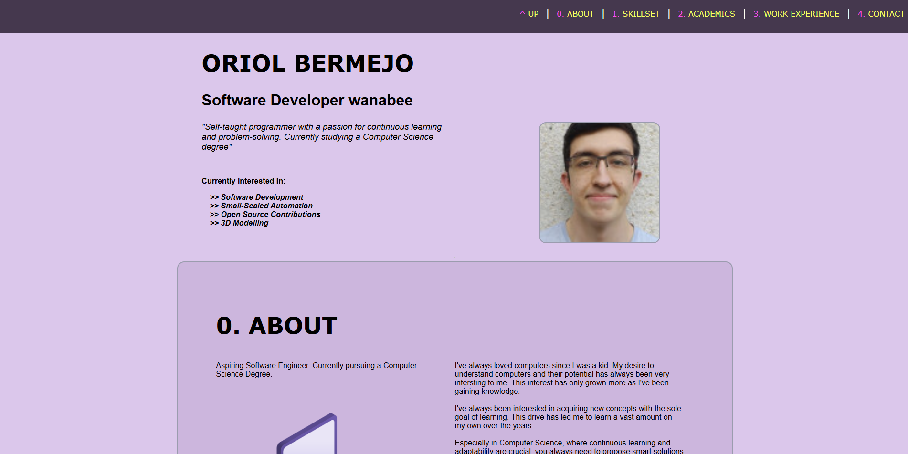

# Hypermedia project. Part 1

This projest's webpage is aimed to serve as a potential webpage-shaped professional curriculum vitae (CV).

You can see it's contents through [this link](google.com)

 ## Project analysis

 - ### User profile (Persona): 

Since this website serves as a work resume, the "target" visitor could be any HR employee from a company that is searching for employment. It might also be someone interested in my profesional bio who aims to either contact about me for profesisonal purposes (maybe someone searching for people in a startup) or maybe just someone that is trying to contact me via mail that searches for my name.

There are not many constraints relating to age or nationality, since the webpage is written in plain english.

The aim is simple. This webpage has to serve as a presentation card for anyone interested in me either profesionaly or formaly (ranging from someone I already know to a complete stranger). 

 - ### Information architecture

The webpage is simpe and direct. The first thing you see is my name, a picture of me plus some personal information (current interests, personal situation). There is a navigation bar at the top that can help you reach information faster.

This is the first thing you see:

Everything is classified in 5 categories:

> **About**: Some personal information about me and my interests.

> **Skilset**: All technical skills that could be of interest for any kind of CS job (from basic coding to 3D modelling). As well as Spoken tongues

> **Academics**: My academic information (Current academic level, Degrees, etc.)

> **Work Experience**: Pretty much self-explanatory.

> **Contact**: My phone number(obviously fake, don't worry), email and [GitHub Acount](https://github.com/Oriol35).

All this information is displayed as direct as possible (no clicks for navigation) and all information has been strategically positioned in order to present the most important things first. 

Everything is classified and presented in a list form, to make sure no one misses anything (in order to read you only need to go section by section, from top to bottom).

The main reason the page is kept simple and direct also takes into account keeping everything important in text form. that way, if someone for example tries to print or process my webpage, there is not any kind of resistance (I am aware this makes the webpage easily webscrappable).

 - ### Visual Design:
   
#### Aspects taken into account:

- **Fonts**: Formed by straight, uniform lines to mantain a formal format (Verdana, Arial, Helvetica, Sans serif, etc).

- **Color distribution**: I used A monchrome pallet for big elements on the screen.

- **Contrast**: I kept low contrast on the main page ang a high brightness+HUE contrast for ui elements like the navigation header.

- **Information flow**: Everything is either on the bar at the top or at the center of the screen, so you can focus easily.

- **Shapes**: The combination of pastel colors within round objects helps with cohesion. That's the reason why the navigation bar is rectangular and has more harsh colors (by doing that you inherently make it stand out more).  

As I said before, I tend to keep things simple so they can be more effective. But that does not mean it's the best strategy. For example if you ask most people about this website most people will critizise how simple it is. And that's because I did not apply enough design notions into my design (partly because of my **skill issues**). in my opinion this could've been better, but at the same time I like simple pages that don't need to put barriers on you and just inform you... it might be nostalgia, but I still have a lot to learn if I want to be at the same level of today's standards.

[Link to my Figma project](https://www.figma.com/design/JXUJvgUTxrT1NQhXrxVdH4/CV-website?m=auto&t=gsnKoEnPReT9opVY-1)

You should be able to freely watch the project! Thank you for visiting ^^
